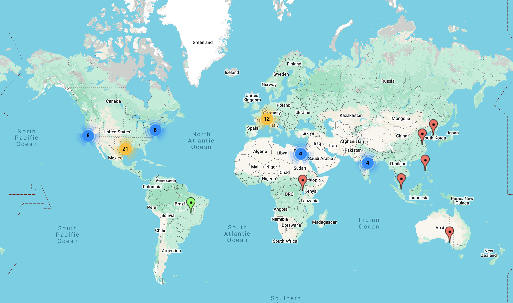

# Everything is still bigger in Texas: The 5th Pan-Structural Variation Hackathon in the Cloud!

The *"Structural Variant Crying Club"* is back and more determined than ever — we’re excited to announce the **5th Structural Variants in the Cloud Hackathon**, coming to you this fall!

From 27-29 Aug, 2025, **DNAnexus** will once again team up with **Baylor College of Medicine** in Houston, Texas to host this hybrid bioinformatics hackathon. With support from friends at NCBI and others in the genomics community, we’ll bring together researchers, students, and developers who are passionate about solving real-world challenges in structural variant (SV) analysis — whether you're joining us in person or virtually over Zoom.

## 🧬 Topics we might explore this year include:

* SV annotation using pan-genome and graph-based references

* Novel approaches for benchmarking SV callers across diverse populations

* Large-scale SV curation and visualization

* SV impacts on transcript structure and splicing

* Integration of SVs in rare disease diagnostics pipelines

* Mobile element insertions in population-scale datasets

* Exploring long-read metagenomic assembly for SV discovery

* Mosaic/Somatic variant detection

* Assembly annotation and pan-genome-based approaches for enhancing variant calling accuracy

Got another idea? We’re always open to bold and creative proposals that push the boundaries of SV research!

## 🧑‍🎓 Who Should Apply

We’re looking for motivated individuals with experience in genomics, bioinformatics, structural variation, or related fields. Whether you’re a graduate student, postdoc, data scientist, or software developer, if you’re interested in complex variation, genome graphs, precision medicine, or building pipelines on the cloud — this hackathon is for you!

This is a collaborative event, not a competition. You’ll join a team of 5–6 participants and work together on a real, open-ended bioinformatics project. Teams will have access to cloud-based computing resources, support from experts in the field, and lots of caffeine-fueled inspiration.

## 🌍 Where in the world are our hackathon participants from?
This map shows the incredible global reach of our past Structural Variation Hackathons — participants have joined us from across North America, Europe, Asia, and beyond! Whether dialing in from bustling research centers or quiet home offices, our community proves that impactful science knows no borders. We can’t wait to see where this year’s attendees will be joining from!

## 🏗️ Organization & Format
After a brief kickoff and organizational session, teams will spend four full days tackling a challenging set of problems related to structural variation and large-scale datasets. Teams will analyze and integrate public datasets, share insights, and collaborate in a highly interactive environment. Throughout the event, we’ll also gather to discuss progress, best practices in bioinformatics, coding standards, and more.

On the final day, each team will give a short presentation on their work. The top two teams will receive special prizes sponsored by Oxford Nanopore Technologies and Pacific Biosciences!

## 📊 Datasets
This year’s datasets will be drawn from public repositories, with a focus on long-read sequenced trios, pan-genome base graphs, and short-read datasets from the Sequence Read Archive (SRA), all ported to cloud infrastructure. Some projects may also involve assembled contigs derived from these datasets.

## 🧰 Products & Publications
All code, pipelines, and scripts developed during the hackathon will be shared publicly via the [Collaborative Bioinformatics GitHub](https://github.com/collaborativebioinformatics). Teams will also be encouraged to submit manuscripts describing their work to outlets such as F1000Research (Hackathons Channel), BMC Bioinformatics, GigaScience, Genome Research, or PLOS Computational Biology.

Check out our previous publications!

* 2019: 1st hackathon paper https://f1000research.com/articles/9-1141 
* 2020: 2nd hackathon paper https://f1000research.com/articles/10-246 
* 2021: 3rd hackathon paper https://f1000research.com/articles/11-530/v1 
* 2023 5th hackathon paper https://f1000research.com/articles/13-708 
* 2024: in preparation 

## 💻 How It Works

Selected applicants will be assigned to project teams before the event begins. Projects will be announced shortly before the hackathon kicks off, and will build upon ideas from previous NCBI-style hackathons, community initiatives, and ongoing genomics challenges.

The event runs across four full days, so please make sure you're able to commit to the entire duration. No registration fees. Just bring your brain, your laptop, and your curiosity.

## 🫵 How to Apply

📝 Applications are due by 10th of Aug CDT via [here](https://docs.google.com/forms/d/1mPW2Vw-7xe_sJiHt-r53-ibbYCjxw3hzhyhuW0FmI1A/edit?ts=67e277e1)

💻 Basic scripting knowledge (e.g., Shell, Python, R) is helpful but not required.

We can’t wait to see what ideas you bring to the table! If you have any questions, feel free to reach out to Ben Busby or Fritz Sedlazeck via fritz.sedlazeck@bcm.edu.

